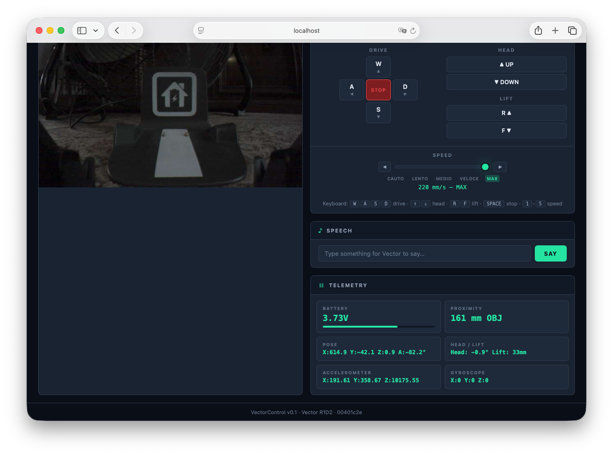
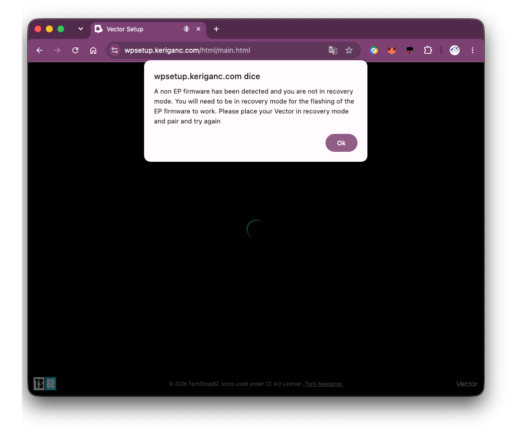
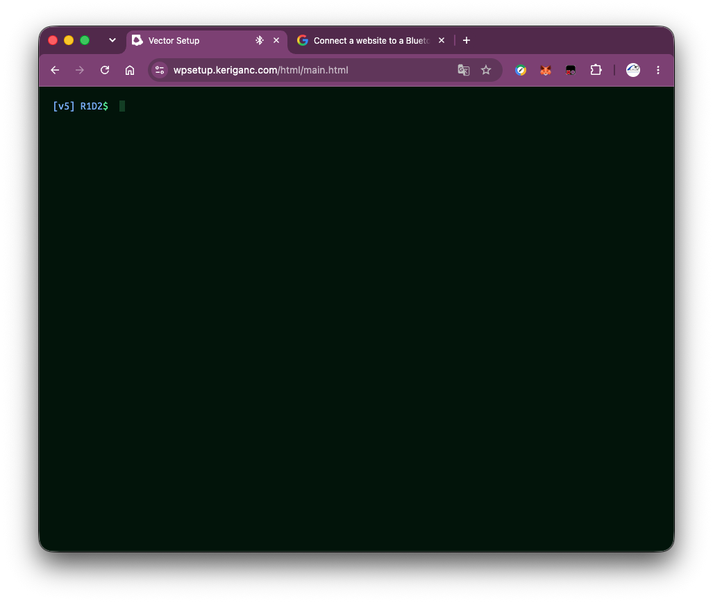
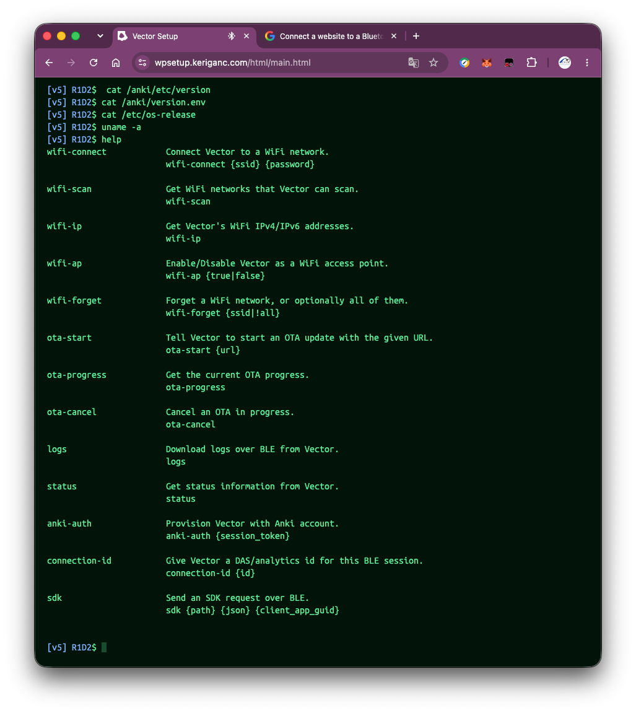
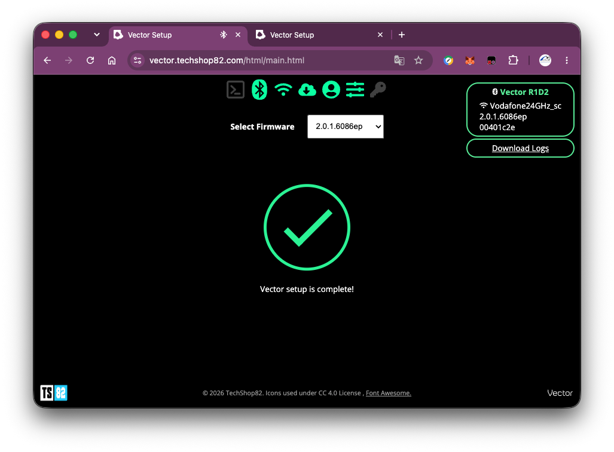
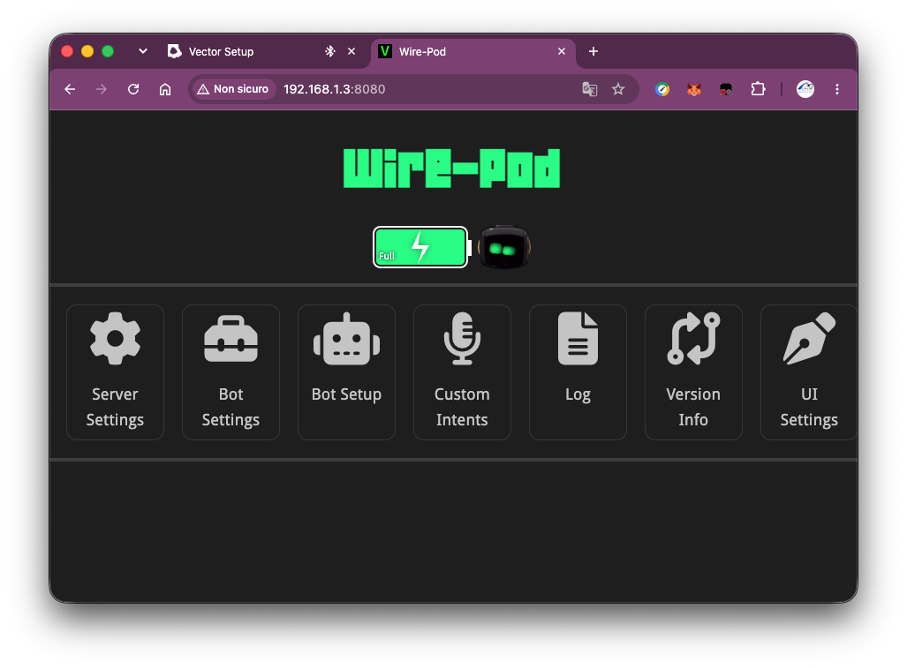

# VectorControl

A modern Python application for controlling an original first-generation **Anki Vector** robot from a Mac, featuring a real-time web dashboard with live camera feed, WASD controls, telemetry, and text-to-speech.




## The Problem

Anki went bankrupt in 2019. Digital Dream Labs (DDL) acquired Vector but their cloud servers have been **unreliable since April 2023**. The original `anki-vector` Python SDK (v0.6.0) depends on those dead servers for authentication — making it **unusable** for most Vector owners in 2024-2026.

This project documents the complete journey of bringing a first-gen Vector back to life with a fully local, cloud-free setup.

## Hardware

| Detail | Value |
|--------|-------|
| Robot | Anki Vector (1st generation) |
| Model | 300-00059 |
| Name | Vector R1D2 |
| Serial | `00401c2e` |
| Original firmware | `v1.7.0.3412` |
| Updated firmware | `v2.0.1.6086ep` |

## What This Project Does

- **Web Dashboard** on `http://localhost:4001` with:
  - Live camera feed (640×360 MJPEG via WebSocket, ~10 FPS)
  - WASD keyboard + click controls for driving, head, and lift
  - 5-level speed control (40–220 mm/s)
  - Real-time telemetry (battery, proximity, pose, accelerometer, gyroscope)
  - Text-to-speech input
  - Go Home / Off Charger buttons
- **Terminal remote control** (`main.py`) using curses
- **Diagnostics tool** for troubleshooting connectivity
- **Modular architecture** ready for future extensions (autonomous navigation, ArUco markers, web UI improvements)

## Setup Journey & Problems Encountered

### Problem 1: The Original SDK Is Dead

The official `anki-vector` PyPI package (v0.6.0, last updated May 2019) requires Anki's cloud servers for authentication. Those servers are **permanently offline**. Running `python -m anki_vector.configure` simply fails.

**Solution:** Use [`wirepod-vector-sdk`](https://pypi.org/project/wirepod-vector-sdk/) (v0.8.1) — a community fork maintained by [kercre123](https://github.com/kercre123/wirepod-vector-python-sdk). It installs under the same `anki_vector` namespace but works with [Wire-Pod](https://github.com/kercre123/wire-pod), a free local server replacement.

### Problem 2: Wire-Pod Requires EP Firmware



Wire-Pod needs Vector to run **Escape Pod (EP) firmware** — a special build with `ep` suffix in the version string. Our Vector had standard firmware `v1.7.0.3412` (no `ep`).

The normal flow is:
1. Put Vector in recovery mode (hold back button 15 seconds → `anki.com/v` screen)
2. Use [wpsetup.keriganc.com](https://wpsetup.keriganc.com) in Chrome to flash EP firmware via Bluetooth

**What went wrong:**
- The Bluetooth Web API pairing kept disconnecting when Vector entered recovery mode
- The site would show "ACTIVATE" but lose the Bluetooth connection before the firmware could be sent
- Chrome remembered stale Bluetooth pairings that interfered with new connections
- The "auto-setup flow" checkbox caused redirect loops

### Problem 3: Bluetooth Pairing Loop

After pairing via Chrome's Web Bluetooth, the setup page would either:
- Show the error *"A non EP firmware has been detected and you are not in recovery mode"* (when Vector was in normal mode)
- Lose the Bluetooth connection immediately (when Vector was in recovery mode)
- Loop between "PAIR WITH VECTOR" and "Vector has disconnected"

**Failed attempts:**
- Pairing in normal mode, then switching to recovery mode → connection lost
- Pairing in recovery mode directly → Chrome couldn't maintain the connection
- Removing Bluetooth pairing from macOS System Settings → Vector wasn't listed there (Web Bluetooth manages its own pairings)
- Using Chrome Incognito mode → same issue
- Using `chrome://bluetooth-internals` → "Forget" didn't resolve it

### Problem 4: The BLE Console Breakthrough

**Solution:** On wpsetup.keriganc.com, **unchecking "Enable auto-setup flow"** before entering the PIN revealed a hidden **BLE console** — a direct command-line interface to Vector over Bluetooth:





```
[v5] R1D2$ help
wifi-connect    Connect Vector to a WiFi network.
wifi-scan       Get WiFi networks that Vector can scan.
wifi-ip         Get Vector's WiFi IPv4/IPv6 addresses.
ota-start       Tell Vector to start an OTA update with the given URL.
ota-progress    Get the current OTA progress.
status          Get status information from Vector.
...
```

We tried `ota-start` with several firmware URLs, but they all returned 404 or tiny error responses:
- `http://192.168.1.3:8080/api-sdk/get_ep_ota` → "robot not found in SDK info file" (Vector wasn't authenticated yet — chicken-and-egg problem)
- `http://wpsetup.keriganc.com/firmware/1.8.0.3344/full/lkg.ota` → 404
- `http://ota.techshop82.com/vector-ota/escapepod-prod-1.8.ota` → 404
- `http://ota.pvic.xyz/OSKR_EP_1.7.3_6016.ota` → 404

### Problem 5: The Solution — TechShop82

**What finally worked:** [vector.techshop82.com](https://vector.techshop82.com) — an alternative setup site that:
1. Has a **firmware dropdown** to select the EP version
2. Hosts the firmware files on its own servers
3. Handles the Bluetooth → WiFi → OTA flow more reliably

Steps that worked:
1. Open `https://vector.techshop82.com/html/main.html` in Chrome
2. Select **`2.0.1.6086ep`** from the firmware dropdown
3. Put Vector in recovery mode (`anki.com/v`)
4. Pair via Bluetooth
5. The site connected Vector to WiFi and pushed the firmware OTA
6. Vector rebooted with EP firmware
7. Re-paired and pressed **ACTIVATE** → "Vector setup is complete!"



### Problem 6: SDK Certificate

After Wire-Pod authentication, the Python SDK still couldn't connect:

```
SSL_ERROR_SSL: CERTIFICATE_VERIFY_FAILED: self signed certificate
```

The SDK needs the robot's TLS certificate as a trusted root. Wire-Pod's `session-certs` endpoint returned "cert does not exist" because DDL's certificate servers are down.

**Solution:** Extract the certificate directly from the robot using OpenSSL:

```bash
echo | openssl s_client -connect 192.168.1.30:443 -servername Vector-R1D2 2>/dev/null \
  | openssl x509 -outform PEM > ~/.anki_vector/Vector-R1D2-00401c2e.cert
```

Then we hit `StatusCode.UNAUTHENTICATED: 401` — the GUID in `sdk_config.ini` was wrong. Wire-Pod's API exposes two GUIDs:
- `global_guid` — the Wire-Pod server's GUID (wrong)
- `robots[].guid` — the robot-specific GUID (correct)

Using the robot-specific GUID from `http://WIREPOD_IP:8080/api-sdk/get_sdk_info` fixed it.



### Final Working Configuration

```ini
# ~/.anki_vector/sdk_config.ini
[00401c2e]
cert = /Users/USERNAME/.anki_vector/Vector-R1D2-00401c2e.cert
ip = 192.168.1.30
name = Vector-R1D2
guid = <robot-specific-guid-from-wirepod>
```

## Requirements

- **Python 3.11** (3.10 also works; 3.13 untested with the SDK)
- **macOS** (tested on macOS 26 / Apple Silicon)
- **Wire-Pod** running locally ([install guide](https://github.com/kercre123/wire-pod/wiki/Installation))
- **Anki Vector** with EP firmware, authenticated with Wire-Pod
- **Google Chrome** (for initial Bluetooth setup — Safari doesn't support Web Bluetooth)

## Installation

```bash
# Clone
git clone https://github.com/robertocalvi/VectorControl.git
cd VectorControl

# Create virtual environment
python3.11 -m venv .venv

# Install dependencies
.venv/bin/pip install -r requirements.txt

# Copy and configure environment
cp .env.example .env
# Edit .env with your robot's serial, IP, and Wire-Pod IP
```

### SDK Configuration

The SDK needs a certificate and config file at `~/.anki_vector/`:

```bash
# Extract certificate from robot (replace IP with your Vector's IP)
mkdir -p ~/.anki_vector
echo | openssl s_client -connect YOUR_VECTOR_IP:443 -servername Vector-XXXX 2>/dev/null \
  | openssl x509 -outform PEM > ~/.anki_vector/Vector-XXXX-SERIAL.cert

# Get the robot GUID from Wire-Pod
curl http://YOUR_WIREPOD_IP:8080/api-sdk/get_sdk_info

# Create ~/.anki_vector/sdk_config.ini with the values above
```

## Usage

### Web Dashboard (recommended)

```bash
.venv/bin/python -m web.server
# Open http://localhost:4001
```

**Controls:**

| Key | Action |
|-----|--------|
| W / A / S / D | Drive forward / left / backward / right |
| ↑ / ↓ | Head up / down |
| R / F | Lift up / down |
| SPACE | Emergency stop |
| 1-5 | Speed level (Cauto → Max) |

### Terminal Remote Control

```bash
.venv/bin/python main.py
```

### Diagnostics

```bash
.venv/bin/python tools/vector_diagnostics.py
```

### Connection Test

```bash
.venv/bin/python tests/test_connection.py
```

### Movement Test

```bash
.venv/bin/python tests/test_robot.py
```

## Project Structure

```
VectorControl/
├── .env.example              # Environment template
├── .gitignore
├── README.md
├── requirements.txt          # wirepod-vector-sdk, python-dotenv, fastapi, uvicorn
├── TODO.md                   # Project tracking
│
├── vectorcontrol/            # Core library
│   ├── __init__.py
│   ├── config.py             # Configuration loader (.env + sdk_config.ini)
│   ├── connection.py         # VectorConnection context manager
│   ├── robot.py              # High-level robot commands
│   └── safety.py             # Emergency stop, signal handlers
│
├── web/                      # Web dashboard
│   ├── server.py             # FastAPI backend (camera WS, telemetry WS, motor API)
│   └── static/
│       ├── index.html        # Dashboard UI
│       ├── style.css         # Dark tech theme
│       └── app.js            # Frontend controller
│
├── tools/
│   └── vector_diagnostics.py # Connectivity diagnostics
│
├── tests/
│   ├── test_connection.py    # Connection verification
│   └── test_robot.py         # Movement sequence test
│
└── main.py                   # Terminal remote control (curses)
```

## Tech Stack

| Component | Technology |
|-----------|-----------|
| Robot SDK | [wirepod-vector-sdk](https://pypi.org/project/wirepod-vector-sdk/) 0.8.1 |
| Local server | [Wire-Pod](https://github.com/kercre123/wire-pod) v1.2.18 |
| Backend | FastAPI + uvicorn |
| Camera stream | WebSocket (base64 JPEG, ~10 FPS) |
| Telemetry | WebSocket (JSON, 2 Hz) |
| Frontend | Vanilla HTML/CSS/JS (no framework) |
| Protocol | gRPC over TLS (protobuf) |

## Available Telemetry

| Sensor | Data |
|--------|------|
| Battery | Level, voltage, charging state |
| Proximity | Distance (mm), object detection |
| Pose | X, Y, Z position + heading angle |
| Accelerometer | 3-axis acceleration |
| Gyroscope | 3-axis angular velocity |
| Head | Angle in radians |
| Lift | Height in mm |

## Future Plans

- [ ] OpenCV ArUco marker detection
- [ ] Autonomous navigation with waypoints
- [ ] Nav map visualization
- [ ] Face recognition integration
- [ ] Audio feed streaming
- [ ] Local AI integration (LLM-driven behaviors)
- [ ] Multi-robot support

## Key Resources

- [Wire-Pod](https://github.com/kercre123/wire-pod) — Free local server for Vector
- [wirepod-vector-python-sdk](https://github.com/kercre123/wirepod-vector-python-sdk) — Python SDK fork
- [vector.techshop82.com](https://vector.techshop82.com) — Alternative firmware flashing tool
- [wpsetup.keriganc.com](https://wpsetup.keriganc.com) — Official Wire-Pod setup page
- [Vector SDK docs](https://keriganc.com/sdkdocs) — SDK documentation
- [Vector TRM (Bible)](https://github.com/GooeyChickenman/victor/blob/master/documentation/Vector-TRM.pdf) — Technical reference

## License

MIT
